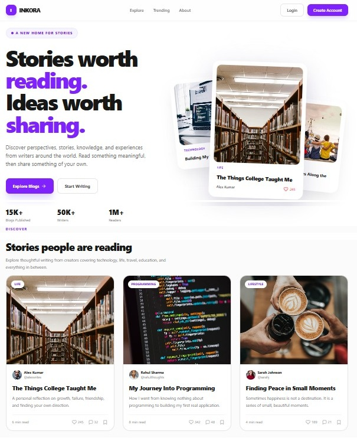

# INKORA

A blogging site where writers publish their work as a PDF and readers can follow them, save posts, like, and comment.

I built this as my internship project. React + Vite on the front, PHP 8 + MySQL on the back, both served from the same domain.

It started as a frontend-only build with everything in localStorage. All the data handling was kept inside `src/utils`, which meant adding the real backend later only touched that folder — none of the pages had to change.

**Live site:** https://darkturquoise-mandrill-722077.hostingersite.com/

**Demo account:** `alex@inkora.app` / `inkora123`

---

## Screenshots



---

## What it does

**Reading**
- Feed with For You / Following / Trending tabs
- Search by title, description, author, category or tag
- Category filters, and the search stays in the URL so you can share a result page
- A separate clean reading view at `/read/:id` with a progress bar at the top
- PDFs open in the page with page navigation and zoom

**Social stuff**
- Like, save, follow, comment, and reply to comments
- Saving a blog on the feed updates your profile straight away — no refresh needed, and it works across tabs too
- Public profile for every writer at `/u/:username`
- Share button uses the phone's native share sheet, falls back to copying the link

**Writing**
- Create page with a live preview and a checklist so you can see what's still missing
- Upload a thumbnail and a PDF, both validated for type and size
- Edit or delete your own posts (deleting also removes the files and comments)

**Account**
- Signup / login / logout, passwords are hashed before being stored
- `/create`, `/profile`, `/settings` and `/notifications` need you to be logged in — if you're not, it sends you to login and brings you back after
- Editable profile with a photo and a cover image

**Other**
- Notifications for likes, comments, replies and follows
- Settings for privacy, notifications, password and appearance
- Dark mode across the whole app, remembered after a reload
- Loading skeletons, empty states, error states, and a fallback for images that fail to load
- Works down to 375px, keyboard focus rings, ARIA labels, skip links

---

## Built with

**Frontend**
- React 19
- Vite
- Tailwind CSS v4
- React Router v8
- pdf.js for the PDF viewer

**Backend**
- PHP 8, no framework
- MySQL 8, accessed through PDO with prepared statements
- bcrypt passwords, HttpOnly session cookies
- Uploads stored on the server filesystem

---

## Running it

**Requirements:** Node 18+, and PHP 8 + MySQL if you want the backend running locally (XAMPP is the easy way).

The frontend alone will start without the backend, but every request will fail — there's nothing to talk to.

```bash
npm install
```

```bash
npm run dev
```

Then open http://localhost:5173.

| Command | What it does |
|---|---|
| `npm run dev` | dev server on :5173 |
| `npm run build` | builds into `dist/` |
| `npm run preview` | serves the built version locally |

### Pointing the dev server at a backend

`npm run dev` only runs the React side. It needs a PHP backend to talk to, or
every request fails with a 502 and the terminal shows `ECONNREFUSED`.

Copy `.env.example` to `.env` and set one line:

```
VITE_API_PROXY=https://darkturquoise-mandrill-722077.hostingersite.com
```

That proxies `/api` and `/uploads` to the deployed backend, so there is nothing
to install. Note it reads and **writes the live database** - anything you create
while testing shows up on the real site.

To keep it fully local instead, install XAMPP, point it at this folder, and use:

```
VITE_API_PROXY=http://localhost
```

None of this applies in production. The build and the API are served from the
same domain, so `/api` is just a path.

### Database

1. Create a MySQL database
2. Import `api/schema.sql`
3. Copy `api/config.example.php` to `api/config.php` and fill in your details
4. Open `/api/seed.php` once to create sample accounts and blogs, then delete that file

The seeded login is:

```
alex@inkora.app
inkora123
```

You can also just sign up normally.

---

## Folder structure

```
src/
├── App.jsx              routes
├── main.jsx
├── index.css            tailwind + dark mode + a11y styles
│
├── components/
│   ├── BlogPdf.jsx      loads the stored file, then the reader
│   ├── PdfReader.jsx    the actual pdf.js viewer
│   ├── RequireAuth.jsx  login check for protected routes
│   ├── SafeImage.jsx    image with loading + fallback handling
│   └── States.jsx       skeletons, empty state, error state, toast
│
├── pages/
│   ├── Landing/
│   ├── Auth/            login + signup
│   ├── Feed/
│   ├── Discover/
│   ├── Blog/            full blog page with comments
│   ├── BlogReader/      clean reading view
│   ├── Create/          create + edit
│   ├── Profile/
│   ├── PublicProfile/
│   ├── Settings/
│   ├── Notifications/
│   └── NotFound/
│
└── utils/
    ├── api.js           fetch wrapper, all requests go through here
    ├── apiStore.js      small cache so the hooks stay synchronous
    ├── blogStorage.js   blogs
    ├── session.js       accounts + login
    ├── social.js        likes, saves, follows, comments, views
    ├── notifications.js
    ├── settings.js
    ├── format.js
    └── useToast.js

api/
├── index.php           router
├── db.php              PDO connection
├── helpers.php         responses, sessions, validation
├── auth.php            signup, login, profile, account
├── blogs.php           blog CRUD, search, views
├── social.php          likes, bookmarks, follows
├── comments.php
├── notifications.php
├── users.php           public profiles + stats
├── settings.php
├── uploads.php         file uploads
├── schema.sql
└── seed.php            run once, then delete
```

### Routes

| Path | Page | Login needed |
|---|---|---|
| `/` | Landing | no |
| `/home` | Feed | no |
| `/discover` | Discover | no |
| `/blog/:id` | Blog | no |
| `/read/:id` | Reader | no |
| `/u/:username` | Writer profile | no |
| `/login`, `/signup` | Auth | no |
| `/create` | Create | yes |
| `/blog/:id/edit` | Edit | yes |
| `/profile` | Profile | yes |
| `/settings` | Settings | yes |
| `/notifications` | Notifications | yes |
| anything else | 404 | no |

---

## How the data flows

None of the pages call `fetch`. They all use hooks from `src/utils`, and those talk to the API. Keeping that boundary is what made swapping localStorage for MySQL a change in one folder rather than a rewrite.

`src/utils/apiStore.js` is a small cache sitting under those hooks. It hands back cached data straight away so nothing flashes, de-duplicates concurrent requests for the same thing, and refetches after a mutation. Without it, every page would need its own loading state and the same blog list would get fetched five times on one screen.

Likes and bookmarks update the UI before the request finishes and roll back if it fails — waiting 400ms for a bookmark icon to fill in feels broken on a phone even when nothing is wrong.

Dark mode is the one thing still kept in localStorage as well as the database, because the theme has to be applied before React mounts. Waiting on a round trip would mean a white flash on every page load.

The database schema and the full API reference are in [BACKEND.md](BACKEND.md).

---

## Things I know aren't finished

- **No email.** Password reset and email notifications need an SMTP service configured.
- **Google sign-in** is stubbed out — it needs OAuth credentials and a verified domain.
- **No pagination on the feed.** The API takes `limit` and `offset`, the feed just doesn't use them yet. Fine at this size.
- **Search uses `LIKE`, not the fulltext index.** Fulltext ignores words shorter than four characters by default, and people search for things like "ai".
- **Images are served at whatever size they were uploaded.** Should generate thumbnails on upload.
- **Expired sessions and old login attempts** aren't cleaned up on a schedule yet — those tables grow slowly forever until a cron job clears them.

---

## Next steps

1. Email (password reset, notification digests)
2. Pagination and infinite scroll on the feed
3. Proper fulltext search
4. Image resizing on upload, served from a CDN
5. A cron job to clear expired sessions
6. Rich text posts, so a blog doesn't have to be a PDF

---

## Deploying

The React app builds to static files; the API is plain PHP. Both go in `public_html` on the same domain.

Two `.htaccess` files do the work, and Vite copies them into `dist/` on every build:

- `public/.htaccess` — sends unknown paths to `index.html` so refreshing on `/blog/some-id` doesn't 404, and explicitly leaves `/api` and `/uploads` alone
- `public/uploads/.htaccess` — turns off the PHP engine in the uploads folder

`DEPLOY.md` has the full steps for Hostinger.
